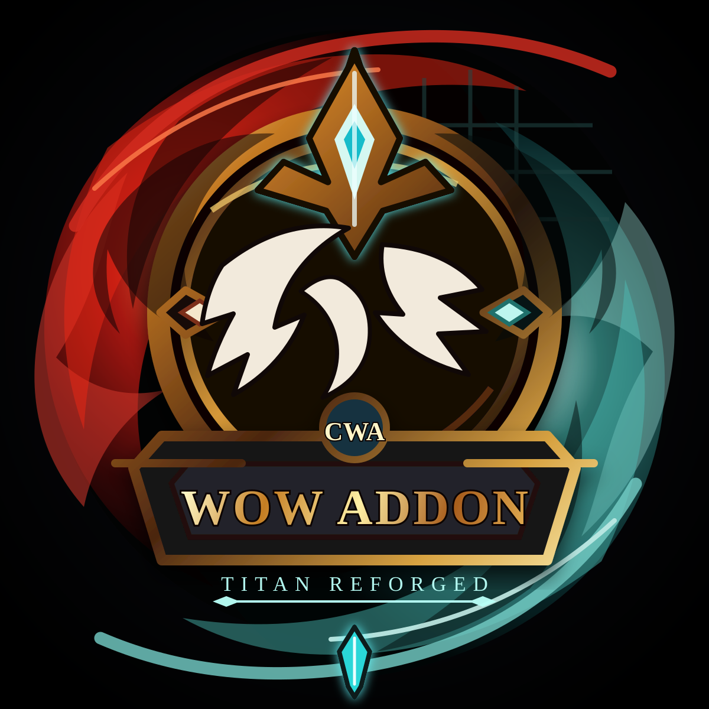

<p align="center">
  
</p>

# Chris Wow Addon

A starter World of Warcraft Titan Reforged addon workspace using TypeScript, Node.js, TypeScriptToLua, and CurseForge-compatible packaging.

The target game flavor is Classic Titan Reforged (`_classic_titan_`) with TOC interface `38001`. Development and local install are set up for macOS with WoW under `/Applications`.

## Quick Start

```sh
npm install
npm run build
npm run package
```

## Dev loop (build + install + watch)

For day-to-day work, run the dev watcher. It builds the addon, copies it into your WoW `AddOns` folder, then keeps watching TypeScript, assets, and the TOC. After each change, run `/reload` in-game to see updates.

```sh
npm run dev
```

Override the install path if needed (same as `install:addon`):

```sh
WOW_ADDONS_DIR="/Applications/World of Warcraft/_classic_titan_/Interface/AddOns" npm run dev
```

The TypeScript entry point is `src/main.ts`. Builds generate:

- `build/main.lua`: raw TypeScriptToLua output.
- `main.lua`: root addon Lua file for packagers.
- `dist/ChrisWowAddon`: installable addon folder.
- `dist/ChrisWowAddon-0.1.0.zip`: uploadable addon zip from `npm run package`.

## Local Install (macOS)

This project targets a macOS dev setup. Battle.net installs World of Warcraft under `/Applications`. On this machine, the only `Interface` folder is Titan Reforged:

```text
/Applications/World of Warcraft/_classic_titan_/Interface/AddOns
```

`npm run install:addon` scans `/Applications/World of Warcraft` for flavor folders (names like `_classic_titan_`) and uses the first `Interface` folder it finds, preferring `_classic_titan_`.

Build and copy the addon into that folder (one-shot, no watch):

```sh
npm run install:addon
```

For continuous sync while editing, prefer `npm run dev` instead.

If your AddOns path is different, override it:

```sh
WOW_ADDONS_DIR="/Applications/World of Warcraft/_classic_titan_/Interface/AddOns" npm run install:addon
```

Then launch or reload WoW and try:

```text
/cwa
/cwa stats
/cwa reset
/cwa debug
/cwa options
```

`/cwa debug` prints the client build, interface number, locale, project id, and whether the loaded client matches the Titan interface expected by this addon.
`/cwa options` opens the addon's settings panel. The round minimap logo button opens the same panel with left-click, prints debug info with right-click, and can be dragged around the minimap edge.

## CurseForge Packaging

This repo includes `.pkgmeta` and a GitHub Actions workflow using `BigWigsMods/packager`.

Before publishing:

1. Create the addon project on CurseForge.
2. Replace `## X-Curse-Project-ID: 0` in `ChrisWowAddon.toc` with the real CurseForge project ID.
3. Add a GitHub repository secret named `CF_API_KEY`.
4. Push a version tag such as `v0.1.0`.

The workflow installs Node dependencies, compiles TypeScript to Lua, and lets the packager publish the release.

## Notes

CurseForge is the distribution and packaging target here; WoW addons themselves still run Lua in-game. TypeScriptToLua bridges the TypeScript authoring experience into WoW-compatible Lua.
